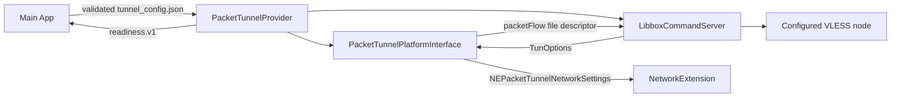

# SPEC-0060 — Core Engine Implementation (sing-box / Libbox)

> Revalidated: 2026-09-04
> Evidence boundary: implementation, current strict App/PacketTunnel/test-target builds, a pinned gVisor/uTLS-enabled Libbox build, device logs with a successful HTTPS probe, and user-confirmed normal use; the complete signed-device traffic matrix is still pending.

## 1. User outcome

Packet Tunnel Extension 必须把 Apple 的 packet flow 可靠交给 sing-box，并且只有 Libbox core 已启动、Apple tunnel settings 已应用时才报告 provider ready。系统 `.connected` 或 core start 仍不能单独证明远端握手、DNS 和出口流量可用。

## 2. Architecture



Libbox 的 TUN inbound 不是“无需额外处理”。在 Apple Network Extension 中，Libbox 必须获得实现 `LibboxPlatformInterfaceProtocol` 的桥接对象，由它完成：

- 从 `LibboxTunOptionsProtocol` 转换 IPv4/IPv6 address、included/excluded routes、DNS 和 MTU；
- 调用 `setTunnelNetworkSettings` 并 fail closed 等待结果；
- 把 `NEPacketTunnelFlow` 对应的 tunnel file descriptor 交给 Libbox；
- 使用 `NWPathMonitor` 报告默认接口变化；
- stop/error 时关闭 monitor、service 和本地状态。

## 3. Current startup contract

1. App 在调用 `startVPNTunnel` 前解析选定线路的 hostname，并把数值 IPv4/IPv6 地址写入 App Group；Extension 随后读取并严格验证 schema v2 `TunnelConfiguration`，兼容迁移 schema v1。全隧道启动阶段不得再对代理 hostname 做 DNS。
2. 使用 App Group 内独立 base/working 目录调用 `LibboxSetup`，关闭 debug 日志。
3. 用 `LibboxCheckConfig` 预检结构化 JSON；schema 或编译能力不匹配时可恢复地失败，不进入 core startup。
4. 创建带 Apple platform interface 的 `LibboxCommandServer`。
5. `service.start()` 后调用 `startOrReloadService`，并始终传入非空 `LibboxOverrideOptions`；当前绑定会解引用该参数，传 `nil` 会导致 Extension 进程崩溃。
6. 仅当上述步骤同步成功后把 provider-local readiness 返回为 true；App 在系统 `.connected` 后还必须完成匿名 HTTPS 2xx/3xx data-plane probe，才能将用户状态显示为 Protected。任一步启动失败都关闭 service 并把错误返回系统。

当前最小 TUN JSON 使用 sing-box 1.12+ 的 `address` 字段：

```json
{
  "log": { "level": "error" },
    "inbounds": [
    {
      "type": "tun",
      "tag": "tun-in",
      "interface_name": "utun",
      "address": ["172.19.0.1/30"],
      "auto_route": true,
      "strict_route": true
    }
  ],
  "outbounds": [
    {
      "type": "vless",
      "tag": "proxy",
      "server": "<validated host>",
      "server_port": 443,
      "uuid": "<validated UUID>"
    }
  ],
  "route": { "final": "proxy" }
}
```

已移除的 `inet4_address` 不得重新引入。实际 Network Extension settings 还会把代理服务器解析后的 IPv4 `/32`、IPv6 `/128` 加入 excluded routes，防止全隧道默认路由递归代理端点。单元回归会同时检查字段结构并用 `LibboxCheckConfig` 验证带 `chrome` uTLS fingerprint 的配置；当前完整 arm64 测试 bundle 已编译链接，仍须在签名设备/健康 arm64 XCTest 环境实际执行。

## 4. Security, resource and distribution constraints

- Extension 不记录用户流量、完整节点 URL、UUID、token 或 DNS 内容。
- 不通过代码混淆规避审核；Network Extension 行为、VPN 用途、第三方 core 与隐私实践必须在 Review Notes/法律材料中如实披露。
- Packet Tunnel 的实际内存峰值、重连、Wi-Fi/蜂窝切换和前后台恢复必须用目标真机测量，不能把未经验证的固定内存数字当作平台保证。
- 当前 bundled XCFramework 已记录 source commit、Go/gomobile 版本、tags 和两个 archive checksum，见 `docs/00_agentic/LIBBOX_PROVENANCE.md`。官方 upstream 为 GPLv3-or-later；独立复现、匹配源留存、LICENSE/NOTICE/对应源码义务和法律审查仍未完成。
- `PacketTunnelPlatformInterface` 已移除 `socket.fileDescriptor` KVC/动态 selector，只调用 generated public declaration 的 `LibboxGetTunnelFileDescriptor()`；该符号由 PacketTunnel target 内的公开系统 API utun bridge 提供，Libbox framework 保持纯核心引擎。2026-09-01 真机诊断又确认旧 archive 缺少 `with_utls`，现已替换为 pinned uTLS/low-memory build，并启用仅供内部启动/重载使用的 `with_clash_api`（不暴露外部监听）。App、Extension 和 arm64 test bundle 编译链接通过；相同线路的签名真机连接、DNS/HTTPS/出口与资源回归仍是发布前硬阻塞。

## 5. Release verification

发布证据必须至少包含：

- 在健康 Xcode host 实际运行 Libbox config regression 和全部 iOS tests；
- 带正确 App Group/Network Extension entitlement 的 signed install；
- iOS 16+ 真机 Wi-Fi 与蜂窝：connect、远端握手、DNS、出口变化、disconnect；
- background/foreground、network switch、余额耗尽断开、Pro 不扣时；
- Extension 资源峰值与无敏感日志检查；
- bundled Libbox 的匹配源、checksum、license/notices 和 privacy/legal approval。

在这些证据完成前，本项状态只能是 build-verified + user-reported device evidence，不能写成 independent device-verified 或 release-ready。
