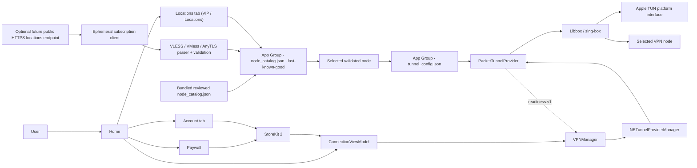

# Aster VPN Architecture

> Last verified: 2026-09-01
> Evidence cutoff: current workspace, generated Xcode project, current strict App/Extension/test-target builds, release guards, SSV verifier tests and user-reported pre-fd-bridge device connection

## System Context

Aster 由前台 SwiftUI App 与 Packet Tunnel Extension 组成。App 负责用户意图、线路 catalog、StoreKit 和 VPN 编排；Extension 负责受限进程内的 tunnel data plane。跨进程配置只通过 App Group 中经过验证的文件传递，readiness 通过版本化 provider message 返回。

## Current Architecture

## Module Contracts

| Module | Responsibility | Durable state | Evidence |
| --- | --- | --- | --- |
| `AsterApp` | Tab-root composition, foreground catalog refresh and Firebase Analytics initialization | App Group/catalog and StoreKit system state | Build-verified |
| Connection | Status hierarchy, selected location, circular connect/disconnect control, access gates and recoverable messages | None | Build-verified; latest UI runtime pending |
| Locations | Restore bundled/cache catalog, optionally fetch, parse, install last-known-good, select one node | `node_catalog.json`, `tunnel_config.json` | Bundle/build verified; live tunnel and future feed switching pending |
| Account | Pro status/expiration, upgrade/restore, privacy and legal entry points | StoreKit system state | Build-verified; StoreKit sandbox pending |
| Subscription | Load real StoreKit products/eligibility, buy, restore, observe entitlement | StoreKit system state | Build-verified; sandbox pending |
| `VPNManager` | Manage provider preferences/session/status and readiness | System VPN preferences | Build-verified; owner reports existing-line connection |
| Shared config | Version, validate and atomically persist current node config | `tunnel_config.json` | Build/unit-bundle verified |
| Packet Tunnel | Build sing-box config, start/stop Libbox, apply TUN settings and report readiness | None | Build-verified; full device matrix pending |
| Libbox | Bundled sing-box mobile core | XCFramework binary | Linked; provenance/reproducibility unresolved |

## Location Catalog Flow

1. 首发版本从 App Bundle 读取审核后的 `node_catalog.json` 并写入 App Group；`AsterNodeSubscriptionURL` 仅在未来启用远端更新时接受公开 HTTPS 地址。
2. `URLSessionNodeSubscriptionClient` uses an ephemeral session, no cache/cookies, bounded timeouts, 1 MB limit, HTTP 200 and same-host HTTPS redirects.
3. `NodeSubscriptionParser` accepts plain/Base64 lines and a maximum of 200 supported VLESS/VMess/AnyTLS entries. It rejects invalid/duplicate fields, insecure flags, unsupported transport, new VLESS without TLS/Reality and AnyTLS without TLS.
4. Each node becomes a validated `VPNNode`; the opaque stable ID is derived from normalized connection fields and does not contain the UUID.
5. A complete verified snapshot is atomically installed as `node_catalog.json`. Any fetch/parse/save failure preserves the previous snapshot and surfaces a user-recoverable message.
6. Selection writes only the chosen `TunnelConfiguration` to `tunnel_config.json`. The Extension never reads the remote feed or business catalog.
7. Refresh occurs when stale (6 hours), on foreground and on manual request. A timestamp in the future does not suppress refresh.
8. A previously selected valid config missing from a new feed remains as “Current Location”; this preserves the owner's already-working route until a deliberate migration policy exists.

### Schemas

- **Catalog snapshot:** timestamp plus validated array of `VPNNode`; local-only cache schema.
- **Tunnel schema v2:** node ID, host/port, UUID or AnyTLS password, protocol (`vless`/`vmess`/`anytls`), transport (`tcp`/`websocket`/`grpc`), TLS/server name/ALPN, WS headers/path, gRPC service, VLESS flow/Reality/uTLS fields or VMess security/alter ID.
- **Migration:** schema v1 decodes into v2-compatible VLESS fields. Validation occurs after decoding and before every save/use.
- **Boundary:** The remote subscription format is input, not the Extension IPC contract. Unsupported feed entries are discarded; a feed with zero safe nodes is rejected as a whole.

## Connection and Time Flow

1. App restores StoreKit entitlement. Pro users can connect; free users can use a one-time ten-minute protected-usage allowance. The allowance starts only after readiness, accumulates only while Protected, pauses on disconnect, and then guides the user to upgrade.
2. The user chooses a location while disconnected. Catalog selection persists the exact validated current config.
3. `VPNManager` requires a valid `tunnel_config.json`, then calls `startVPNTunnel()`.
4. Extension builds structured sing-box JSON, starts Libbox and applies Apple network settings through the platform interface.
5. System `.connected` alone is insufficient. The App probes `readiness.v1` for up to five seconds.
6. Only a ready connection displays Protected. Disconnect and lost readiness stop the session; failures surface a recoverable message.

`dataPlaneReady` proves local engine/settings startup, not remote handshake, DNS or Internet exit. A non-sensitive traffic-ready probe and signed device evidence remain required.

## Monetization Boundary

The App Store target is StoreKit-only. No third-party advertising SDK, consent flow, rewarded balance or ad identifier is shipped in the binary. The legacy `Backend/AdMobSSV` service remains outside the app target only until Product/Legal confirms whether it can be archived.

## Security and Privacy Boundaries

- App/Extension do not log traffic content, full subscription URLs, node UUID/token or purchase receipt.
- Catalog/config writes are atomic and use iOS file protection in the App Group.
- A URL embedded in the binary is recoverable. Production must use a revocable app-specific endpoint, not a personal/master provider token.
- App-owned PrivacyInfo declares the APIs and data behavior of app code; the current App Store target has no advertising SDK manifest to aggregate.
- Privacy Policy and Terms remain available from Account/Settings and Paywall; no custom privacy disclosure sheet or ad-consent flow is shown on launch. Firebase Analytics uses a minimal event contract and does not receive browsing content, destination URLs, DNS queries or packet payloads.
- The Packet Tunnel does not introspect `NEPacketTunnelFlow`. After applying network settings it calls the generated public `LibboxGetTunnelFileDescriptor()` declaration; the PacketTunnel target supplies the public-system-API utun resolver and the bundled Libbox framework supplies the core engine. Release guards reject private KVC/selector patterns and verify the symbol in the signed extension executable. This boundary and the initial device bootstrap are verified; real traffic/DNS regression and matching binary provenance remain required.
- Libbox source revision, reproducible toolchain, GPLv3 obligations, notices and privacy provenance are unresolved.

## Project Configuration

- `project.yml` is the target/build-setting/entitlement SSOT; run `./setup.sh` after every change.
- Both App and Extension declare `packet-tunnel-provider` and `group.com.astervpn.shared` through XcodeGen properties. Release tests verify the generated entitlement plists.
- Debug and Release use the same StoreKit-only product surface. Release rejects unsafe Privacy URL and unsafe/missing locations URL.
- Required Release input is `ASTER_PRIVACY_POLICY_URL`; `ASTER_NODE_SUBSCRIPTION_URL` is optional while the bundled catalog is the source of truth.

## UI and entitlement presentation

- The root is a three-tab shell: Home, VIP and Account. Home and Account use top-aligned, hidden-indicator scroll containers so content is not vertically compressed on smaller screens or larger accessibility text sizes; the VIP tab remains scrollable because its length is data-driven and starts on the VIP plans sub-tab. Home's location entry opens the same screen on the Locations sub-tab.
- Home shows the circular power control, current region, and the Pro value/upgrade surface in that order. This keeps the frequent connection/location actions above the conversion surface while leaving the upgrade reason visible at the bottom of the same scroll path. Account is the single destination for subscription, restore and legal actions. `SubscriptionTier` separates capability tiers from billing cadence; only verified StoreKit products mapped in `AppConfiguration` are surfaced (currently monthly/yearly both map to Pro).
- `VPNManager` does not load or save a `NETunnelProviderManager` during app initialization. The first load/save (and therefore Apple's VPN authorization prompt for a fresh install) is deferred until the user taps Connect; subsequent launches reuse the saved manager without presenting a launch-time prompt.
- The Locations VIP tab loads verified StoreKit products on entry and renders localized names, descriptions, and prices directly; selecting a card is enough to prepare the purchase CTA, with no intermediate “view plans” action. Introductory trial copy is shown only when StoreKit reports eligibility for that product.
- Account displays the verified StoreKit entitlement state. For an active subscription with an expiration date it shows a localized neutral `Access through <date>` label; it never claims renewal unless StoreKit supplies that evidence. Free users see a clear upgrade CTA.
- No custom privacy disclosure sheet is shown on launch or before connection. Privacy Policy and Terms of Use remain available in Account/Settings and the Paywall legal section; Apple’s VPN configuration permission is shown only by the system when connection requires it.

## Verification and Operations

- `./setup.sh`: passed after the latest project/source changes.
- Current strict generic Simulator builds: `Aster`, `AsterTests` and `AsterUITests` targets each pass, producing the latest App, PacketTunnel, resources and 50-unit/9-UI bundles.
- XCTest runtime: 50 unit + 9 UI tests are currently inventoried; an earlier 45-test run on iOS 26.5 x86_64 produced 44 pass, 1 explicit Libbox/Go architecture skip and 0 failures/unexpected. New parser/region/cache/recovery cases and the Account/tab/control UI cases await runtime execution. The first UI run found disclosure contrast/state-injection defects; after fixing them, CoreSimulator UI query/screenshot/shutdown timed out, so current UI runtime is not passed.
- SSV: 12/12 Node tests, syntax check, official registry audit 0 and non-root container smoke passed.
- Device: owner reports the existing line connected; no recorded line-switch/network/DNS/exit matrix.

See [PROJECT_STATUS.md](../PROJECT_STATUS.md) for evidence levels and blockers, [TODO.md](TODO.md) for remaining work, and [DECISIONS.md](DECISIONS.md) for rationale.
