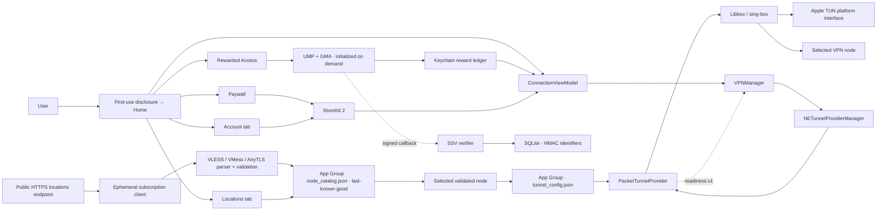

# Aster VPN Architecture

> Last verified: 2026-08-31  
> Evidence cutoff: current workspace, generated Xcode project, current strict App/Extension/test-target builds, release guards, SSV verifier tests and user-reported pre-fd-bridge device connection

## System Context

Aster 由前台 SwiftUI App 与 Packet Tunnel Extension 组成。App 负责用户意图、线路 catalog、访问资格、StoreKit 和 VPN 编排；Extension 负责受限进程内的 tunnel data plane。跨进程配置只通过 App Group 中经过验证的文件传递，readiness 通过版本化 provider message 返回。

## Current Architecture

## Module Contracts

| Module | Responsibility | Durable state | Evidence |
| --- | --- | --- | --- |
| `AsterApp` | First-use disclosure sheet, tab-root composition, foreground catalog refresh | `@AppStorage` disclosure acknowledgement | Build-verified |
| Connection | Status hierarchy, selected location, circular connect/disconnect control, access gates and recoverable messages | None | Build-verified; latest UI runtime pending |
| Locations | Restore catalog/current config, fetch, parse, install last-known-good, select one node | `node_catalog.json`, `tunnel_config.json` | Build/unit-bundle verified; live feed/device switching pending |
| Account | Pro status/expiration, free balance, upgrade/restore, privacy and legal entry points | StoreKit system state + Keychain ledger | Build-verified; StoreKit sandbox pending |
| Rewarded access | Voluntary ad preparation/display, earned callback, client frequency/time policy | This-device-only Keychain | Build/unit-bundle verified; live ad pending |
| SSV verifier | Verify Google signature/contract, deduplicate and apply server reward quota | SQLite with HMAC IDs | 12/12 locally test-verified; deployment pending |
| Subscription | Load real StoreKit products/eligibility, buy, restore, observe entitlement | StoreKit system state | Build-verified; sandbox pending |
| `VPNManager` | Manage provider preferences/session/status and readiness | System VPN preferences | Build-verified; owner reports existing-line connection |
| Shared config | Version, validate and atomically persist current node config | `tunnel_config.json` | Build/unit-bundle verified |
| Packet Tunnel | Build sing-box config, start/stop Libbox, apply TUN settings and report readiness | None | Build-verified; full device matrix pending |
| Libbox | Bundled sing-box mobile core | XCFramework binary | Linked; provenance/reproducibility unresolved |

## Location Catalog Flow

1. `AppConfiguration` accepts only a public HTTPS `AsterNodeSubscriptionURL`; Release must inject `ASTER_NODE_SUBSCRIPTION_URL`.
2. `URLSessionNodeSubscriptionClient` uses an ephemeral session, no cache/cookies, bounded timeouts, 1 MB limit, HTTP 200 and same-host HTTPS redirects.
3. `NodeSubscriptionParser` accepts plain/Base64 lines and a maximum of 200 supported VLESS/VMess/AnyTLS entries. It rejects invalid/duplicate fields, insecure flags, unsupported transport, new VLESS without TLS/Reality and AnyTLS without TLS.
4. Each node becomes a validated `VPNNode`; the opaque stable ID is derived from normalized connection fields and does not contain the UUID.
5. A complete verified snapshot is atomically installed as `node_catalog.json`. Any fetch/parse/save failure preserves the previous snapshot and surfaces a user-recoverable message.
6. Selection writes only the chosen `TunnelConfiguration` to `tunnel_config.json`. The Extension never reads the remote feed or business catalog.
7. Refresh occurs when stale (6 hours), on foreground and on manual request. A timestamp in the future does not suppress refresh.
8. A previously selected valid config missing from a new feed remains as “Current Location”; this preserves the owner's already-working route until a deliberate migration policy exists.

### Schemas

- **Catalog snapshot:** timestamp plus validated array of `VPNNode`; local-only cache schema.
- **Tunnel schema v2:** node ID, host/port, UUID or AnyTLS password, protocol (`vless`/`vmess`/`anytls`), transport (`tcp`/`websocket`/`grpc`), TLS/server name/ALPN, WS headers/path, gRPC service, VLESS flow/Reality/uTLS fields or VMess security/alter ID.
- **Migration:** schema v1 decodes into v2-compatible VLESS fields. Validation occurs after decoding and before every save/use.
- **Boundary:** The remote subscription format is input, not the Extension IPC contract. Unsupported feed entries are discarded; a feed with zero safe nodes is rejected as a whole.

## Connection and Time Flow

1. App restores StoreKit entitlement and local rewarded ledger. Pro can connect without time; free users need a positive balance.
2. The user chooses a location while disconnected. Catalog selection persists the exact validated current config.
3. `VPNManager` requires a valid `tunnel_config.json`, then calls `startVPNTunnel()`.
4. Extension builds structured sing-box JSON, starts Libbox and applies Apple network settings through the platform interface.
5. System `.connected` alone is insufficient. The App probes `readiness.v1` for up to five seconds.
6. Only ready + non-Pro begins local balance consumption and displays Protected. Disconnect, lost readiness, Pro entitlement or zero balance stops charging; zero/timeout also disconnects.

`dataPlaneReady` proves local engine/settings startup, not remote handshake, DNS or Internet exit. A non-sensitive traffic-ready probe and signed device evidence remain required.

## Reward Flow and Abuse Boundary

1. Ads are never prepared at cold launch. The user first accepts the app data-use disclosure and explicitly opens Rewarded Access.
2. UMP consent is updated before `MobileAds.start`; an ad loads only when privacy state permits requests.
3. A ledger reservation enforces cooldown, presentation/reward rolling limits, capacity and stable Keychain identity before display.
4. Only the SDK earned callback grants the full 10 minutes once. Technical presentation failure rolls back the attempt; a viewed/closed presentation keeps the 5-minute cooldown/presentation count.
5. SSV carries installation/attempt context and independently verifies Google signatures, duplicate IDs and the 4-reward server quota.

The client grants immediately and SSV reconciles; the server is not yet an authoritative balance service. Also, GMA's declared third-party data behavior materially conflicts with Apple VPN Guideline 5.4, so the App Store business-model decision is a release blocker.

## Security and Privacy Boundaries

- App/Extension do not log traffic content, full subscription URLs, node UUID/token or purchase receipt.
- Catalog/config writes are atomic and use iOS file protection in the App Group; reward state and installation ID use this-device-only Keychain.
- A URL embedded in the binary is recoverable. Production must use a revocable app-specific endpoint, not a personal/master provider token.
- App-owned PrivacyInfo declares the APIs and data behavior of app code only. Aggregated archive disclosures must also include GMA/UMP and Libbox. The packaged GMA manifest declares coarse location, device ID, advertising data, product interaction and tracking.
- First-use disclosure explains VPN routing, local selection/time storage, optional ad SDK data categories and Apple purchase handling before service use or external ad requests.
- The Packet Tunnel does not introspect `NEPacketTunnelFlow`. After applying network settings it obtains the utun descriptor only through the generated, exported Libbox binding `LibboxGetTunnelFileDescriptor()`. Release guards reject private KVC/selector patterns and verify the symbol in both XCFramework slices. This source boundary is build-verified; real-device tunnel regression and matching binary provenance remain required.
- Libbox source revision, reproducible toolchain, GPLv3 obligations, notices and privacy provenance are unresolved.

## Project Configuration

- `project.yml` is the target/build-setting/entitlement SSOT; run `./setup.sh` after every change.
- Both App and Extension declare `packet-tunnel-provider` and `group.com.astervpn.shared` through XcodeGen properties. Release tests verify the generated entitlement plists.
- Debug uses official Google test IDs and no location feed. Release rejects missing/test AdMob IDs, unsafe Privacy URL and unsafe/missing locations URL.
- Required Release inputs currently include `ASTER_PRIVACY_POLICY_URL`, `ASTER_NODE_SUBSCRIPTION_URL` and—only if the ad model is retained—production AdMob IDs.

## UI and entitlement presentation

- The root is a fixed three-tab shell: Home, Locations and Account. Home and Account use `ViewThatFits` fixed compositions and only fall back to a hidden-indicator scroll container for small screens or accessibility text sizes; the Locations list remains scrollable because its length is data-driven.
- Home puts the protection-time summary above the circular power control, then shows the current region and one access surface. The Add time row is at the top of that surface for discoverability; the full-width Pro CTA remains the strongest visual action. Account is the single destination for subscription, restore and legal actions. `SubscriptionTier` separates capability tiers from billing cadence; only verified StoreKit products mapped in `AppConfiguration` are surfaced (currently monthly/yearly both map to Pro).
- Account displays the verified StoreKit entitlement state. For an active subscription with an expiration date it shows a localized neutral `Access through <date>` label; it never claims renewal unless StoreKit supplies that evidence. Free users see the same +10 min reward path and a secondary upgrade CTA.
- The first-use data disclosure is a medium/large, non-dismissible sheet over the tabs. It must be explicitly continued before catalog refresh or any external ad request; full Privacy Policy/Terms links remain available in the sheet and Account.

## Verification and Operations

- `./setup.sh`: passed after the latest project/source changes.
- Current strict generic Simulator builds: `Aster`, `AsterTests` and `AsterUITests` targets each pass, producing the latest App, PacketTunnel, resources and 50-unit/9-UI bundles.
- XCTest runtime: 50 unit + 9 UI tests are currently inventoried; an earlier 45-test run on iOS 26.5 x86_64 produced 44 pass, 1 explicit Libbox/Go architecture skip and 0 failures/unexpected. New parser/region/cache/recovery cases and the Account/tab/control UI cases await runtime execution. The first UI run found disclosure contrast/state-injection defects; after fixing them, CoreSimulator UI query/screenshot/shutdown timed out, so current UI runtime is not passed.
- SSV: 12/12 Node tests, syntax check, official registry audit 0 and non-root container smoke passed.
- Device: owner reports the existing line connected; no recorded line-switch/network/DNS/exit matrix.

See [PROJECT_STATUS.md](../PROJECT_STATUS.md) for evidence levels and blockers, [TODO.md](TODO.md) for remaining work, and [DECISIONS.md](DECISIONS.md) for rationale.
